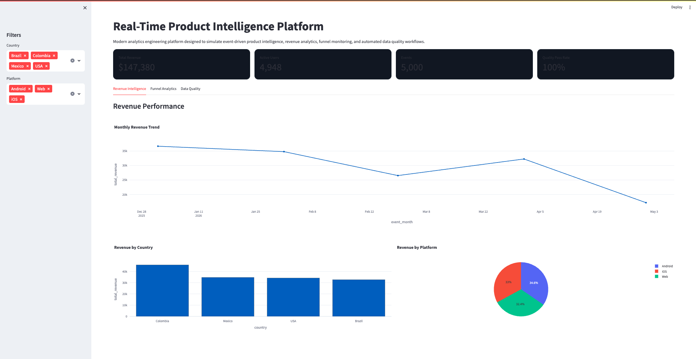
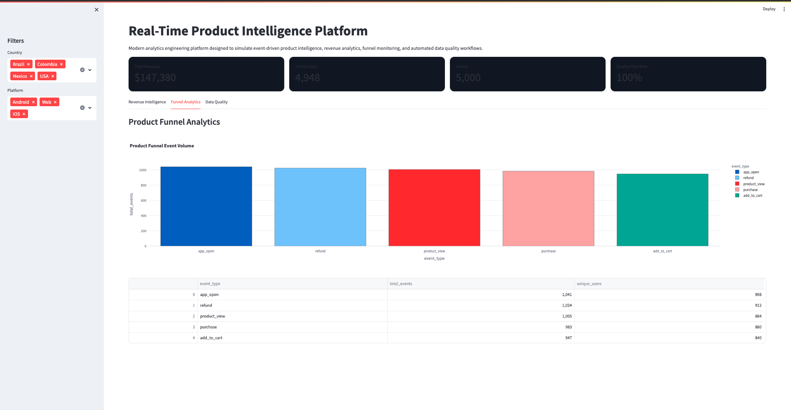
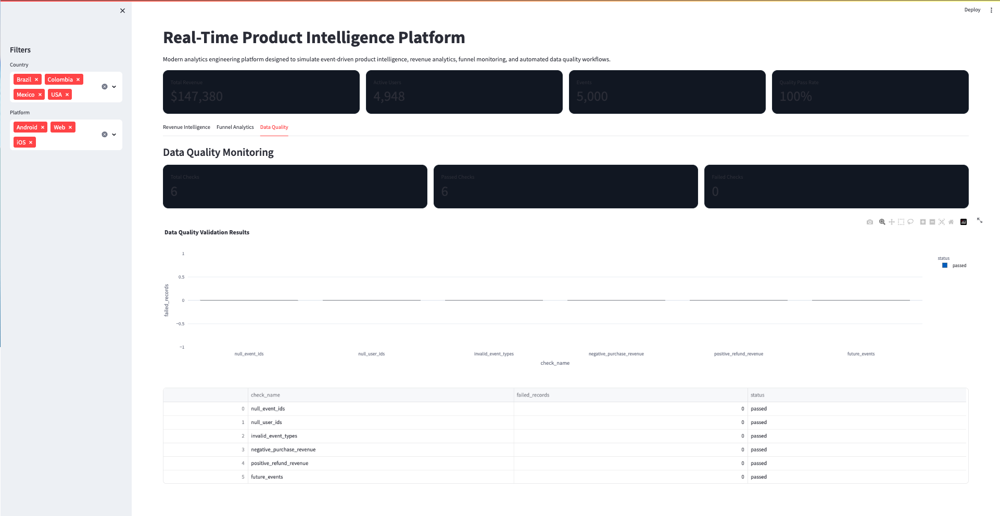

# Real-Time Product Intelligence Platform

Modern analytics engineering platform designed to simulate event-driven product intelligence, revenue analytics, funnel monitoring, and automated data quality workflows.

---

## Platform Overview

This project simulates a production-oriented analytics engineering environment where raw product and revenue events are transformed into trusted analytical insights through layered warehouse modeling, orchestration, quality validation, and executive dashboards.

The platform demonstrates modern analytics engineering concepts including:
- event-driven architectures
- analytical marts
- orchestration pipelines
- data quality monitoring
- executive KPI reporting
- product analytics workflows

---

## Tech Stack

```txt
Python
DuckDB
Pandas
Streamlit
Plotly
Prefect
Parquet
Git/GitHub
```

---

## Architecture

```txt
Event Generator
      ↓
Raw Event Layer
      ↓
DuckDB Warehouse
      ↓
Staging Layer
      ↓
Analytics Marts
      ↓
Quality Monitoring
      ↓
Executive Dashboard
```

---

## Features

### Event Simulation
- Synthetic product and revenue event generation
- Multi-platform event tracking
- Revenue and refund simulation

### Analytics Warehouse
- DuckDB analytical warehouse
- Layered transformations
- Staging and marts architecture

### Data Quality Monitoring
- Automated validation checks
- Revenue consistency monitoring
- Invalid event detection
- Future event validation

### Executive Dashboard
- Revenue intelligence
- Funnel analytics
- Platform monitoring
- Quality observability

### Pipeline Orchestration
- Prefect orchestration workflows
- Modular pipeline execution
- Reproducible analytics workflows

---

## Dashboard Preview

### Revenue Intelligence



### Funnel Analytics



### Data Quality Monitoring



---

## Project Structure

```txt
real-time-product-intelligence-platform/
│
├── app/
├── assets/
├── data/
├── docs/
├── orchestration/
├── scripts/
├── tests/
├── Makefile
├── README.md
├── requirements.txt
└── run_pipeline.py
```

---

## Documentation

- [Architecture Documentation](docs/architecture.md)

---

## Running the Project

Install dependencies:

```bash
pip install -r requirements.txt
```

Run orchestration pipeline:

```bash
make pipeline
```

Launch dashboard:

```bash
streamlit run app/dashboard.py
```

---

## Future Improvements

- Real-time streaming ingestion
- Kafka integration
- Airflow orchestration
- Docker containerization
- Cloud deployment
- Cohort retention analytics
- Anomaly detection

---

## Author

Jacobo Toro Arango

Data & Analytics Engineer focused on scalable analytical systems, revenue intelligence, analytics engineering, and production-oriented data platforms.